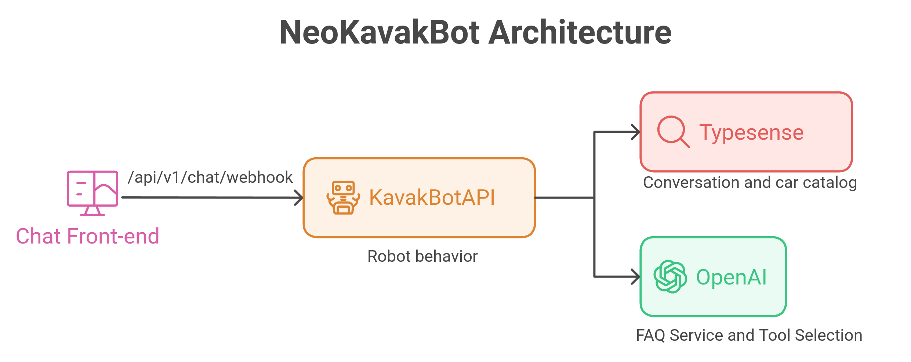
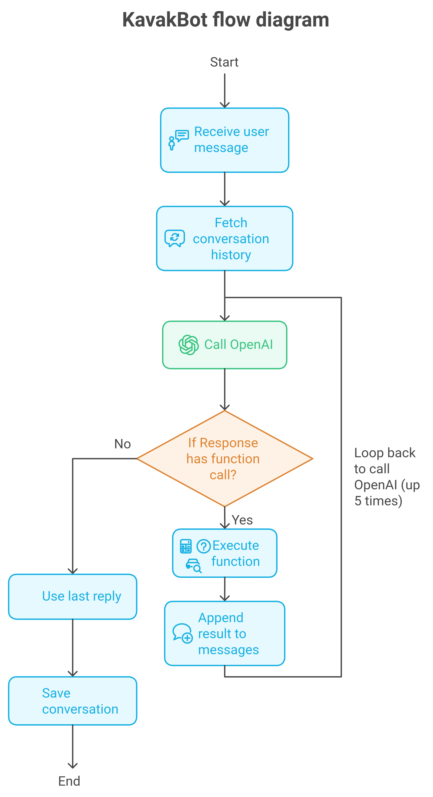
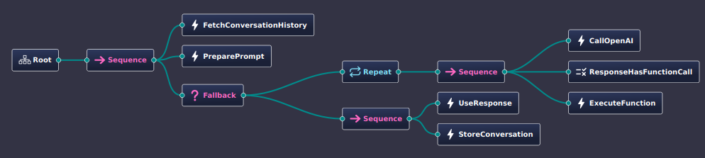
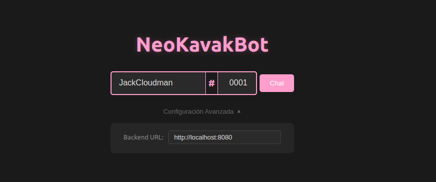
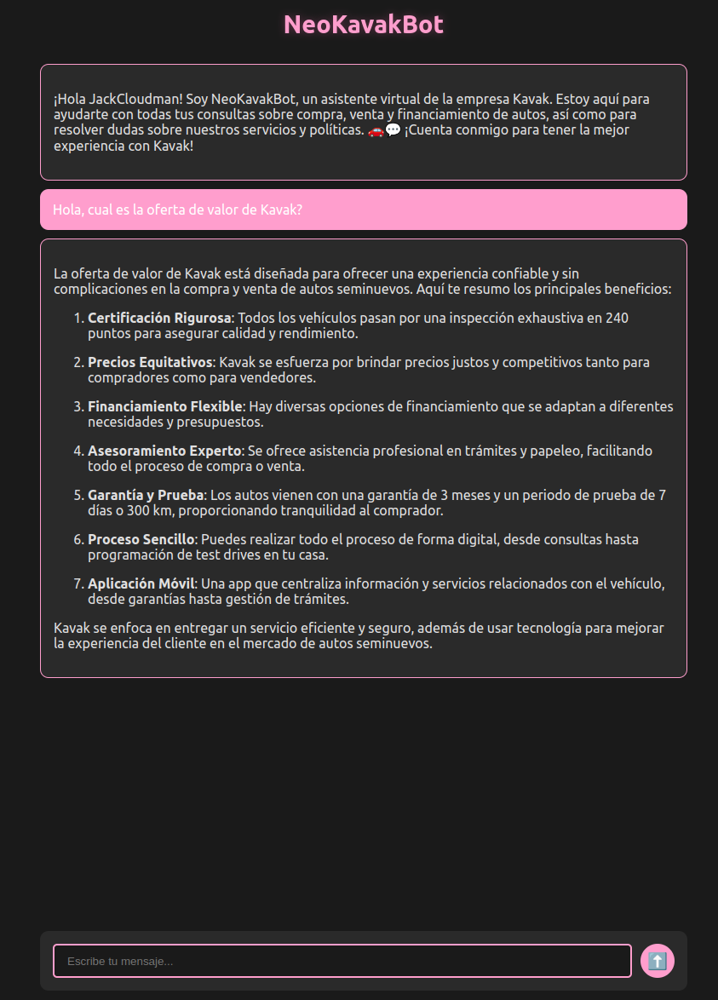

<div style="text-align: left; font-size: 2.5em; margin-bottom: 30px; color: #ff9ecd; text-shadow: 0 0 10px rgba(255, 105, 180, 0.3);">
  NeoKavakBot
</div>

[](https://codecov.io/gh/JackCloudman/KavakBot)

## Table of Contents

- [Overview](#overview)
- [Features](#features)
- [Architecture](#architecture)
- [Installation](#installation)
  - [Prerequisites](#prerequisites)
  - [Using Docker](#using-docker)
- [Usage](#usage)
- [Components](#components)
- [License](#license)

## Overview

KavakBot is a sophisticated chatbot designed to assist users with various functionalities related to Kavak, a leading company in the purchase and sale of pre-owned vehicles. This project was developed as part of a technical assessment for Kavak, showcasing the integration of multiple technologies to deliver a reliable and efficient virtual assistant.

## Features

- **Conversational AI**: Utilizes OpenAI's GPT-4o for natural language understanding and response generation.
- **Behavior Trees**: Implements chatbot logic using a custom library `pybehaviortrees`, a wrapper around `behaviortrees.cpp`.
- **Search Functionality**: Integrates Typesense for efficient searching within the car catalog.
- **Persistent Conversations**: Stores and retrieves conversation history to maintain context.
- **Tool Integration**: Provides tools like car search, financial calculations, and FAQ responses to assist users effectively.
- **Dockerized Deployment**: Simplifies setup and deployment using Docker and Docker Compose.

## Architecture
<div style="text-align: center;">
  
  <p><em>KavakBot Architecture Overview</em></p>
</div>

<div style="text-align: center;">
  
  <p><em>KavakBot Flow Diagram</em></p>
</div>

<div style="text-align: center;">
  
  <p><em>KavakBot Behavior Tree</em></p>
</div>

## Installation

### Prerequisites

- [Docker](https://www.docker.com/get-started) installed on your machine.
- [Docker Compose](https://docs.docker.com/compose/install/) installed.

### Using Docker

The recommended way to install and run KavakBot is by using Docker. Follow the steps below to get started:

1. **Clone the Repository**

   ```bash
   git clone https://github.com/JackCloudman/KavakBot.git
   cd KavakBot
   ```

2. **Set Environment Variables**

   Create a `.env` file in the root directory and add the necessary environment variables:

   ```env
   ENV=development
   CONFIG_PATH=configuration
   OPENAI_API_KEY=your_openai_api_key
   ```

   Replace `your_openai_api_key` with your actual OpenAI API key.

3. **Data Initialization**

    Inside the data folder there is a file called cars.csv, feel free to modify it or add more cars to the list, the file must have the following structure:
    ```csv
   stock_id,kilometers,price,make,model,year,version,bluetooth,length,width,height,carplay,description
    1,10000,100000,Toyota,Yaris,2022,LE,1,1,1,1,1,This is a description
    ```

4. **Build and Run Containers**

   ```bash
   docker-compose up --build
   ```

   This command will build the Docker images and start the following services:

   - **Typesense**: Search backend for the car catalog.
   - **FastAPI Server**: The main API server running KavakBot.
   - **Init Data**: A one-time service to initialize the Typesense collections with demo data.

5. **Access the API**

   Once the containers are up and running, you can access the FastAPI server at `http://localhost:8080`.

## Usage

### API Endpoint

- **Webhook for WhatsApp**

  ```
  POST /api/v1/chat/webhook/whatsappp
  ```

  **Payload:**

  ```json
  {
    "message": "What is Kavak?",
    "phone_number": "+1234567890"
  }
  ```

  **Response:**

  ```json
  {
    "response": "Hello, I'm KavakBot!..."
  }
  ```

### Interacting with the Chatbot

Send a POST request to the webhook endpoint with the user's message and phone number. The chatbot will process the message, interact with integrated tools (like searching for cars or calculating finances), and respond accordingly.

### Small GUI Interface

In the `gui` folder, you can find a small interface to interact with the chatbot, just open the `index.html` file in your browser and start chatting with the bot.
<div style="text-align: center;">
  
  <p><em>Figure 1: Nickname selection</em></p>
</div>

<div style="text-align: center;">
  
  <p><em>Figure 2: Chatbot conversation</em></p>
</div>

## Components

### FastAPI

- **Description**: Serves as the main API framework for handling incoming requests and routing.
- **Key Files**: `main.py`, `app/bootstrap/bootstrapper.py`, `app/routers/api/v1/chat_router.py`

### Behavior Trees

- **Description**: Manages the chatbot's decision-making process using behavior trees implemented via the `pybehaviortrees` library.
- **Key Files**: `app/robot/flows/chatbot_flow.py`, `app/robot/actions/*.py`

### Typesense

- **Description**: Provides fast and typo-tolerant search capabilities for the car catalog.
- **Configuration**: Managed via `docker-compose.yml` and initialized using `scripts/init_data.py`

### OpenAI Integration

- **Description**: Leverages OpenAI's GPT-4o model for generating conversational responses.
- **Configuration**: Managed via environment variables and `configuration/default.json`

## License

This project is licensed under the GNU General Public License v3.0 - see the [LICENSE](LICENSE) file for details.
